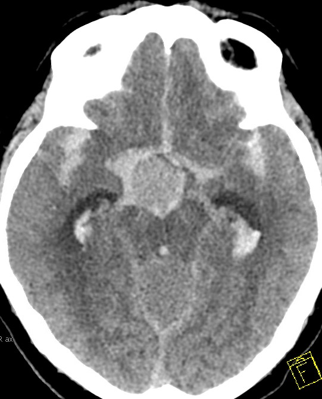
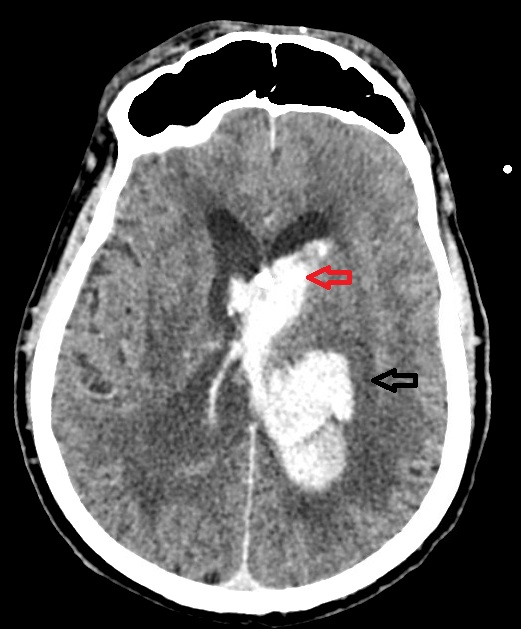
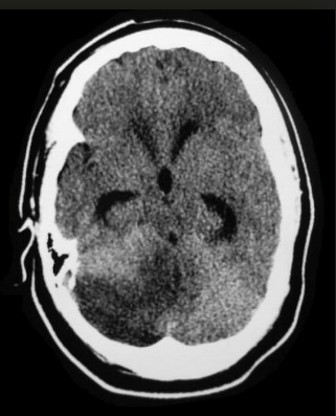

## What is an External Ventricular Drain (EVD)?

An External Ventricular Drain (EVD) is a temporary device inserted into the ventricular system to allow controlled drainage of cerebrospinal fluid (CSF) and monitoring of intracranial pressure (ICP).

It is primarily used for temporary CSF diversion in patients with **acute symptomatic hydrocephalus**.

## Common Indications

1. Subarachnoid hemorrhage (SAH)
2. Intraventricular hemorrhage (IVH)
3. Traumatic brain injury with hydrocephalus
4. Posterior fossa lesions causing obstruction
5. CNS infections with hydrocephalus

## CT Abnormalities

::: {.callout-note collapse="false"}
### Cisternal blood (Basilar aneurysm rupture)

Cisternal blood due to ruptured basilar aneurysm causing obstruction of CSF pathways.

*Source: Dr. Abhijit V. Lele, University of Washington.*
:::

::: {.callout-note collapse="false"}
### Intracerebral hemorrhage with intraventricular extension

Thalamic hemorrhage with intraventricular extension and hydrocephalus.

*Source: Dr. Abhijit V. Lele, University of Washington.*
:::

::: {.callout-note collapse="false"}
### Cerebellar ischemic stroke with edema

Cerebellar ischemic stroke with posterior fossa edema causing compression of the fourth ventricle.

*Source: Dr. Abhijit V. Lele, University of Washington.*
:::

## Clinical Pearls

- **Leveling matters:** Always level the EVD at the tragus for accurate ICP measurement.
- **Drain vs monitor:** An open EVD prioritizes CSF drainage; a clamped EVD allows accurate ICP monitoring.
- **Transport risk:** Clamping an EVD during transport can lead to dangerous ICP elevations.
- **Output trends:** A sudden drop in CSF output may indicate obstruction rather than improvement.
- **Infection prevention:** Maintain a closed system and minimize unnecessary access to reduce infection risk.
