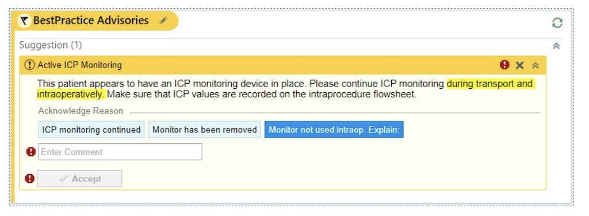
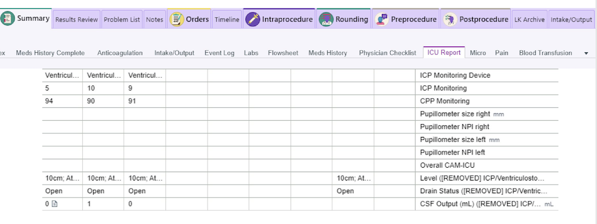
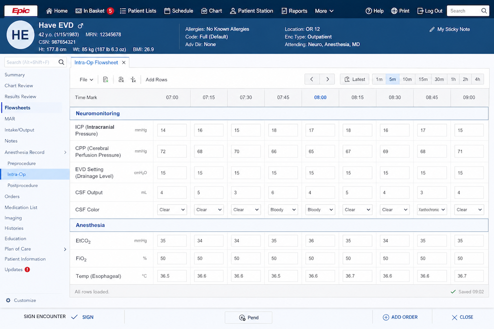

Perioperative workflows and best practice advisories. Educational perioperative EHR workflow examples.

## Identify Patients

**EVD and ICP monitor identification workflows**

Electronic health record systems can improve identification of patients with EVDs and intracranial monitoring devices while enhancing perioperative communication and documentation consistency.

Alerts may appear during perioperative workflow review, ICU handoff, transport preparation, or operating room scheduling workflows.

::: {.callout-tip}
### Example EHR Alert
Example EHR alert identifying patients with:

- External ventricular drains
- ICP monitors
- Brain tissue oxygen monitors
:::

## Preoperative Review

**Suggested perioperative information abstraction**

Suggested perioperative information to review:

- ICP trends
- CSF drainage trends
- Clamp intolerance
- Physiological targets
- Neurosurgery contact information
- Hyperosmolar therapy
- Sedation requirements

The goal is to improve perioperative situational awareness before transport or operating room transfer.

::: {.callout-pearl}
**Clinical Pearls**

- Review clamp intolerance before transport.
- Confirm physiologic targets with ICU and neurosurgery.
- Review hyperosmolar therapy requirements.
- Assess recent ICP trends before OR transfer.
- Ensure multidisciplinary communication.
:::

This module is intended for educational and workflow awareness purposes only. Example screenshots and workflows are hypothetical and should be adapted to institutional EHR systems, policies, and clinical workflows.

## OR Documentation

**Structured perioperative documentation workflows**

Suggested perioperative documentation elements:

- EVD setting (clamp/open status)
- ICP mmHg
- CPP mmHg
- CSF color
- CSF output

Structured documentation may improve communication across ICU, transport, anesthesia, and neurosurgical teams.

