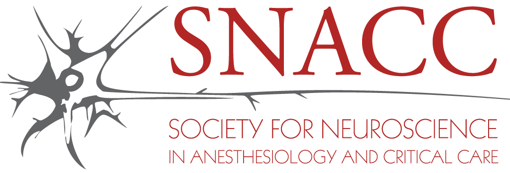

{fig-align="center" style="max-height:90px;"}

Explore the EVD Safety Campaign through educational resources, global outreach initiatives, campaign deliverables, multidisciplinary collaboration, and participation opportunities.

## About the Campaign

The EVD Safety Campaign is an international educational and quality improvement initiative from the Society for Neuroscience in Anesthesiology and Critical Care (SNACC) focused on improving the safety of external ventricular drain (EVD) management across perioperative and neurocritical care environments.

The campaign emphasizes:

- Education
- Standardization
- Transport safety
- ICP monitoring awareness
- Multidisciplinary collaboration
- Prevention of avoidable complications

::: {.callout-tip}
**SNACC EVD Safety Campaign** — visit the official SNACC EVD Safety Campaign website to access educational resources, publications, and collaborative initiatives.

[Open SNACC Campaign Website →](https://snacc.org/external-ventricular-drain-campaign/)
:::

### Campaign Participation

Institutions, clinicians, trainees, nurses, APPs, educators, anesthesiology teams, and neurocritical care professionals worldwide are encouraged to participate in the EVD Safety Campaign.

Participating institutions may be highlighted on the campaign outreach map to showcase international collaboration and commitment to EVD safety.

Participation may include:

- Educational initiatives
- Simulation training
- Local QI projects
- EVD safety protocols
- Transport safety workflows
- Campaign collaboration

## Endorsements

**Supporting organizations and collaborators**

The EVD Safety Campaign has been supported through multidisciplinary collaboration involving neurocritical care, anesthesiology, perioperative safety, and quality improvement leaders.

Key collaborations include:

- Society for Neuroscience in Anesthesiology and Critical Care (SNACC)
- Anesthesia Patient Safety Foundation (APSF)

### Global Participation

The campaign continues to expand through international engagement and multidisciplinary collaboration focused on improving EVD safety worldwide. Currently more than 50 hospitals from more than 30 countries are part of the EVD Safety Campaign.

## Deliverables

**Educational and quality improvement resources**

| Resource | Description | Link |
|---|---|---|
| EVD Educational Video | Educational video resource | [Watch →](https://youtu.be/RYT5QbCEFXc?si=lSjUbyx5pOcW9PFc) |
| SNACC EVD Guidelines | Official guideline resource | [Read →](https://journals.lww.com/jnsa/fulltext/2017/07000/perioperative_management_of_adult_patients_with.1.aspx) |
| SNACC EVD Educational Document | Educational reference material | [Read →](https://snacc.org/snacc-evd-educational-document/) |
| SNACC EVD Quiz | Interactive educational assessment | [Take Quiz →](https://snacc.org/snacc-evd-quiz/) |
| EVD Policy Template | Institutional policy framework | [View →](https://snacc.org/evd-policy-template/) |
| EVD Quality and Safety | Quality improvement resources | [View →](https://snacc.org/evd-quality-and-safety/) |

## Global Outreach

**International collaboration and participation**

The EVD Safety Campaign continues to expand through multidisciplinary international collaboration involving anesthesiology, neurocritical care, nursing, trainees, APPs, educators, and quality improvement leaders.

Participating institutions across the world are contributing to educational outreach, EVD safety awareness, and implementation of quality improvement initiatives.

::: {.callout-tip}
**Campaign Outreach Map** — explore the global reach of the EVD Safety Campaign through the interactive outreach map.

[Open Full Interactive Outreach Map →](https://www.google.com/maps/d/viewer?mid=1gWriwnAK-Gm27Ys9-fZg7MPtUobuUfs&usp=sharing)
:::

### Campaign Outreach Goals

- Promote international EVD safety awareness
- Advance multidisciplinary education
- Share institutional best practices
- Improve transport preparedness
- Reduce preventable EVD complications
- Build a collaborative neurocritical care community

## Join the Campaign

**Who Can Participate?**

The EVD Safety Campaign welcomes participation from:

- Institutions
- Physicians
- Nurses
- APPs
- Trainees
- Educators
- Quality improvement teams
- Neurocritical care collaborators

**Ways to Participate**

- Educational initiatives
- Simulation activities
- Local EVD safety projects
- Protocol implementation
- Research collaboration
- Campaign outreach

::: {.callout-tip}
**Campaign Enrollment** — interested in joining the campaign or having your institution highlighted on the global outreach map?

[Open Enrollment Form →](https://docs.google.com/forms/d/e/1FAIpQLSdqc3pl3ivNlsPBckUQQkEPWrGum2NQCgk_cyVL55JgOQeilg/viewform?usp=sharing&ouid=117721421438305031990)
:::

## Educational Disclaimer

::: {.callout-warning}
This application and campaign materials are intended for educational and quality improvement purposes only. Institutional participation does not imply certification or endorsement of specific clinical protocols.
:::
