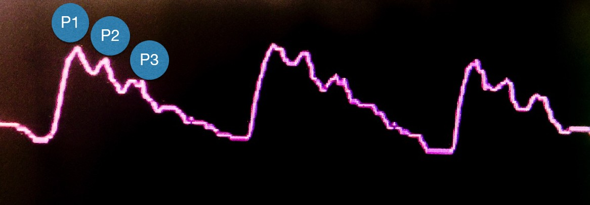
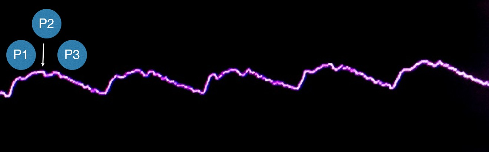

Waveforms often change BEFORE ICP rises → early warning system.

## Normal ICP Waveform

{width=40%}

**Normal:** P1 > P2 > P3 → intact intracranial compliance.

- **P1:** Arterial pulsation
- **P2:** Brain compliance
- **P3:** Venous outflow

*Takeaway: P2 should NEVER exceed P1.*

## Abnormal ICP Waveform

{width=40%}

**Abnormal:** P2 > P1 → reduced intracranial compliance.

- Early intracranial hypertension
- Loss of compensatory reserve
- Precedes ICP elevation

::: {.callout-warning}
**Early Warning:** Waveform changes occur BEFORE ICP rises.
:::

## How to Examine ICP Waveform

Watch how to interpret ICP waveform at the bedside:

```{=html}
<iframe width="100%" height="400" src="https://www.youtube.com/embed/Tt5ZYMvc8-I" frameborder="0" allow="accelerometer; autoplay; clipboard-write; encrypted-media; gyroscope; picture-in-picture" allowfullscreen style="border-radius:12px;"></iframe>
```

::: {.callout-tip}
**Think:** Is P2 higher than P1? What does that imply about compliance?
:::
